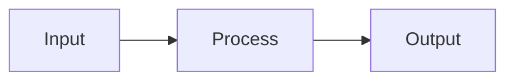
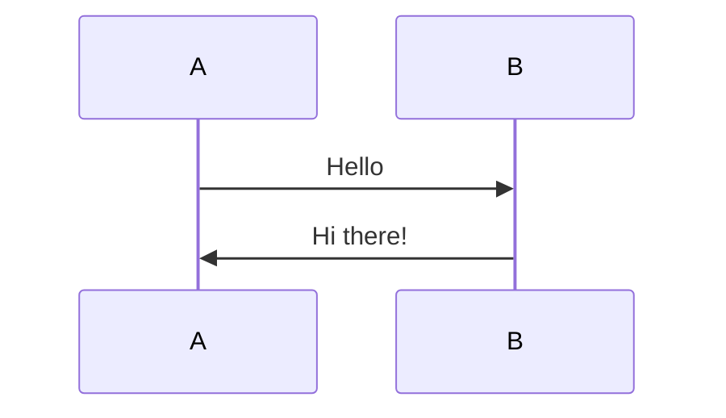

# `<mermaid>` Tag

The `<mermaid>` tag renders Mermaid diagrams and uploads the generated PNG images to Canvas. Diagrams can be defined inline as tag content or referenced from external `.mmd` files.

Mermaid diagrams are rendered at deployment time using the mermaid engine in a playwright browser, converted to high-DPI PNG images, trimmed to remove excess whitespace, and uploaded as Canvas file resources.

## Inline vs File-Based

The tag supports two usage patterns:

### Inline Diagrams

Define the Mermaid source code directly inside the tag:

```xml
<mermaid>
graph TD
    A[Start] --> B{Decision}
    B -->|Yes| C[Success]
    B -->|No| D[Retry]
</mermaid>
```

### External File Reference

Reference a `.mmd` file using the `path` attribute:

```xml
<mermaid path="diagrams/workflow.mmd" />
```

## Attributes

### `path` (optional)

Relative path to an external `.mmd` file containing the Mermaid diagram source.

- If `path` is provided, the tag must be self-closing (`<mermaid ... />`) with no inline content
- If `path` is omitted, inline diagram source is required

```xml
<!-- External file -->
<mermaid path="diagrams/architecture.mmd" />

<!-- Inline source -->
<mermaid>
graph LR
    A[Client] --> B[Server]
</mermaid>
```

### `canvas_folder` (optional)

Canvas files folder where the rendered PNG will be uploaded. Defaults to `deployed_files`.

```xml
<mermaid path="diagrams/flowchart.mmd" canvas_folder="Diagrams" />
```

### `lock_at` / `unlock_at` (optional)

Availability dates for the uploaded image file.

```xml
<mermaid
    path="diagrams/timeline.mmd"
    unlock_at="Jan 15, 2026, 08:00 AM"
    lock_at="Feb 15, 2026, 11:59 PM" />
```

### `alt` (optional)

Alternative text for the generated image (for accessibility).

```xml
<mermaid alt="Process flow diagram">
flowchart TD
    Start([Begin]) --> Process[Process Data]
    Process --> End([Complete])
</mermaid>
```

### `class` (optional)

CSS class(es) to apply to the generated `` tag.

```xml
<mermaid class="diagram-centered" alt="System Architecture">
graph TB
    Client[Client Layer]
    API[API Layer]
    DB[(Database)]
    Client --> API --> DB
</mermaid>
```

### `name` (optional)

Name of the generated file. Defaults to `mermaid-<shortsha>.png`.

```xml
<mermaid id="deployment-diagram" path="diagrams/deployment.mmd" />
```

## Using Mermaid in Markdown

You can use Mermaid diagrams directly in Markdown content without writing XML tags using the fenced code block syntax:

````markdown

````

When processing Markdown, these fence blocks are automatically converted to `<mermaid>` tags and processed by the same rendering pipeline.

You can also use attributes with fence blocks:

````markdown

````

This is useful when mixing Markdown and XML content in the same page.

## Examples

### Simple Inline Flowchart

```xml
<page title="Decision Tree">
    <p>Follow this flowchart to troubleshoot:</p>

    <mermaid alt="Troubleshooting flowchart">
        graph TD
            Start([Problem Detected]) -->|Check Logs| Logs{Error Found?}
            Logs -->|Yes| Fix[Apply Fix]
            Logs -->|No| Contact[Contact Support]
            Fix --> End([Resolved])
            Contact --> End
    </mermaid>
</page>
```

### Diagram from External File

```xml
<page title="Architecture Overview">
    <p>Here's our system architecture:</p>

    <mermaid
        path="diagrams/system-architecture.mmd"
        canvas_folder="Architecture Diagrams"
        alt="System architecture showing client, API, and database layers" />
</page>
```

### Complex Sequence Diagram with Attributes

```xml
<assignment title="API Communication">
    <description>
        Review the sequence of API calls below:

        <mermaid
            id="api-sequence"
            class="diagram-sequence"
            alt="API request/response sequence diagram">
            sequenceDiagram
                actor User
                participant App as Web App
                participant API as REST API
                participant DB as Database

                User->>App: Click Submit
                App->>API: POST /data
                API->>DB: INSERT
                DB-->>API: OK
                API-->>App: 200 Response
                App-->>User: Show Success
        </mermaid>
    </description>
</assignment>
```

### Using Mermaid in Markdown Content

```xml
<page title="Process Flow">
    <p>Here's how the process flows:</p>

    # Step-by-Step Process

    ```mermaid {: alt="Process step diagram" }
    graph TD
        A[Start] --> B[Step 1]
        B --> C[Step 2]
        C --> D[Complete]
    ```

    This diagram shows the main workflow.
</page>
```
