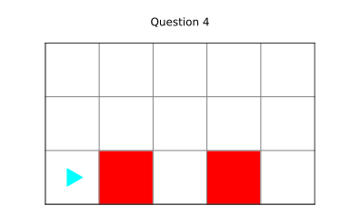
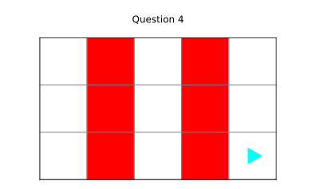

Bit starts in the following world `red_bars`:




Which of the following implementations of `draw_bar` will produce the following result?




```python
from byubit import Bit

def go(bit, color):
    while bit.front_clear():
        bit.move()
        if color is not None:
            bit.paint(color)

def draw_bar(bit):
    pass

@Bit.worlds('red_bars')
def run(bit):
    while bit.front_clear():
        bit.move()
        if bit.is_red():
            draw_bar(bit)

if __name__ == '__main__':
    run(Bit.new_bit)
```